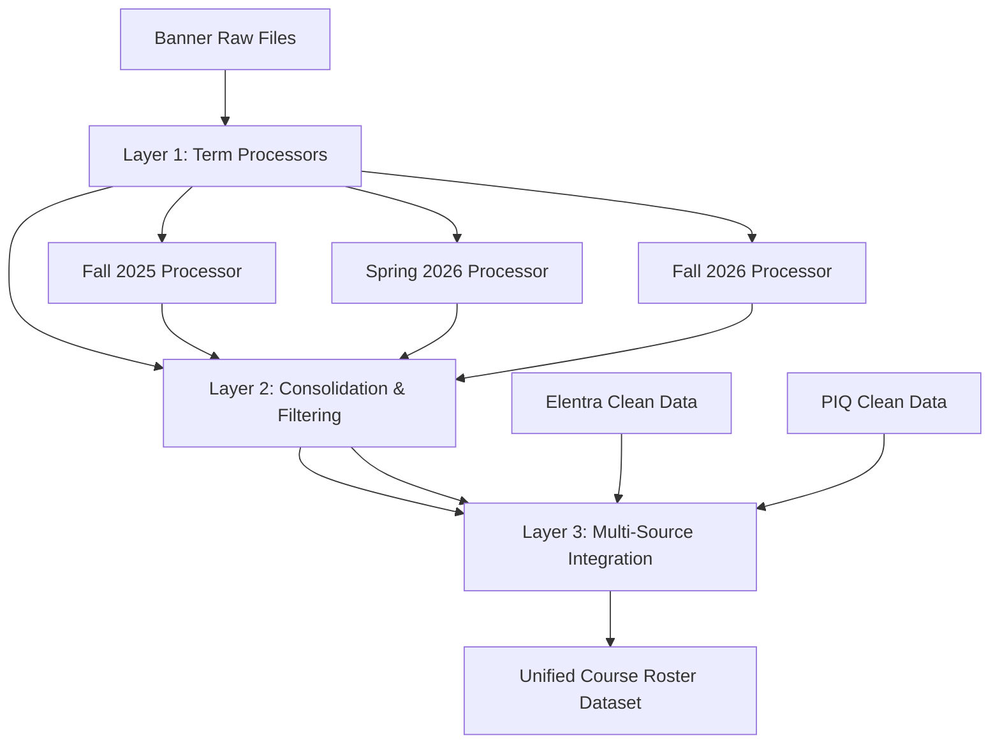

# Banner Multi-Term Processing Architecture

## Overview
This architecture addresses the complexity of Banner's multi-term enrollment data with overlapping academic calendars and graduation filtering requirements through a **three-layer processing approach**.

## The Challenge

### **Banner Term Structure**
- **Spring Term**: January - June
- **Fall Term**: July - December
- **End dates**: Always set to final day of term (not course-specific)

### **MED Academic Calendar Complexity**
- **M1 Year**: July - June
- **M2 Year**: July - March
- **M3 Year**: April - March  
- **M4 Year**: April - May (next year)

### **Data Volume & Overlap**
- **9 files total**: 3 files × 3 terms for complete enrollment picture
- **Graduated student overlap**: Students appear in earlier datasets but not later ones
- **Filtering requirement**: Remove graduated students no longer in current MED academic year

## Three-Layer Architecture



## Layer Implementation

### **Layer 1: Term Processors**
**File**: `VCOM-OAT-DATA-BANNER-TERM-PROCESSOR-v1.pq`

**Purpose**: Process single Banner term with 3-file structure
- **Parameterized by term** (e.g., "202615" for Spring 2026)
- **Campus extraction logic** before section merges
- **MDCO course mapping** via established mapping files
- **Term metadata enrichment** (academic year, semester classification)

**Key Features**:
```powerquery
// Term parameter configuration
TermCode = "202615"  // Set by calling process

// Campus extraction BEFORE merges
sections_with_campus = Table.AddColumn(sections, "EXTRACTED_CAMPUS", each 
    if courseNum <= 800 and section_suffix in ["B","D","L","R"] then
        campus_mapping[suffix]  // ABRY, ADLL, LYNC, ROAN
    else [Campus]
)

// Term-specific folder structure
term_folder = banner_folder{[Name=TermCode]}[Content]
```

### **Layer 2: Consolidation & Filtering**
**File**: `VCOM-OAT-DATA-BANNER-COURSE-ROSTER-CONSOLIDATED-v1.pq`

**Purpose**: Union all terms and apply graduation business logic
- **Multi-term union**: Combines all term processors
- **Graduation detection**: Identifies students missing from latest terms
- **Deduplication**: Removes overlapping enrollments (keeps most recent)
- **Academic year classification**: Maps to MED academic calendar

**Key Filtering Logic**:
```powerquery
// Identify graduated students (appear in early terms but not latest)
GraduatedStudents = Table.SelectRows(StudentTermCounts, each 
    [TermCount] < List.Count(CurrentTerms) and 
    [LatestTerm] <> List.Max(CurrentTerms)
)

// Filter for current enrollments only  
CurrentlyEnrolled = Table.SelectRows(data, each 
    [LIKELY_GRADUATED] = false and
    [BANNER_ENROLLED] = true
)

// Deduplicate overlapping enrollments
Deduplicated = Table.Group(CurrentlyEnrolled, 
    {"STU_UIN", "MDCO_CATUID"}, 
    {{"LatestEnrollment", each Table.FirstN(
        Table.Sort(_, {{"BANNER_TERM_CODE", Order.Descending}}), 1)
    }}
)
```

### **Layer 3: Multi-Source Integration**
**File**: `VCOM-OAT-DATA-COURSE-ROSTER-UNIFIED-v1.pq` (future)

**Purpose**: Integrate clean Banner data with Elentra/PIQ sources
- **References consolidated Banner dataset** (established data reuse principle)
- **Joins with Elentra** course rosters via `MDCO_CATUID`
- **Adds PIQ** supplemental data
- **Creates unified schema** for final consumption

## Benefits of Layered Approach

### **1. Complexity Isolation**
- **Banner complexity** contained in Layers 1-2
- **Clean integration** in Layer 3 with "much cleaner" Elentra/PIQ data
- **Easier debugging** when issues arise in specific layers

### **2. Performance Optimization**
- **Term processors** can run in parallel
- **Consolidated dataset** published to lakehouse for reuse
- **Integration layer** references pre-processed data (established reuse principle)

### **3. Maintainability**
- **Clear separation** of concerns
- **Parameterized term processing** for easy expansion
- **Business logic centralization** in consolidation layer

### **4. Monitoring & Quality**
- **Term-level validation** in processors
- **Consolidation statistics** for graduation filtering monitoring  
- **Integration metrics** for final dataset quality

## Implementation Pattern

### **Term Processor Usage**
```powerquery
// Called with different term parameters
Fall2025_Processor = VCOM-OAT-DATA-BANNER-TERM-PROCESSOR-v1("202505")
Spring2026_Processor = VCOM-OAT-DATA-BANNER-TERM-PROCESSOR-v1("202615")  
Fall2026_Processor = VCOM-OAT-DATA-BANNER-TERM-PROCESSOR-v1("202705")
```

### **Consolidation Process**
```powerquery
// Union all term processors
AllTerms = Table.Combine({Fall2025_Processor, Spring2026_Processor, Fall2026_Processor})

// Apply graduation filtering and deduplication
ConsolidatedBanner = BANNER-CONSOLIDATION-LOGIC(AllTerms)

// Publish to lakehouse as intermediate dataset
```

### **Integration Layer**
```powerquery
// Reference consolidated Banner (not raw processing)
Banner_Data = Lakehouse.Contents("BANNER-COURSE-ROSTER-CONSOLIDATED")

// Integration with clean sources
Unified_Data = INTEGRATION-LOGIC(Banner_Data, Elentra_Data, PIQ_Data)
```

## Academic Calendar Handling

### **Term-to-Academic-Year Mapping**
```powerquery
// Simplified logic - would be more complex in reality
MED_Academic_Year = 
    if TermCode >= "202515" and TermCode <= "202615" then "2025-2026"
    else if TermCode >= "202615" and TermCode <= "202715" then "2026-2027"
    else "UNKNOWN"
```

### **Graduation Detection Strategy**
1. **Identify enrollment patterns** across all terms
2. **Flag students** who disappear from later datasets
3. **Apply business rules** for MED academic year boundaries
4. **Filter out** students not in current academic year

## Next Steps

1. **Implement term processors** with actual Banner file access
2. **Test graduation filtering logic** with real multi-term data
3. **Validate academic calendar mapping** with MED academic calendar rules
4. **Create integration layer** combining with Elentra/PIQ clean data
5. **Deploy to lakehouse** following established dataset patterns

This layered architecture provides a **scalable, maintainable solution** for Banner's complexity while keeping the integration with cleaner data sources simple and efficient.